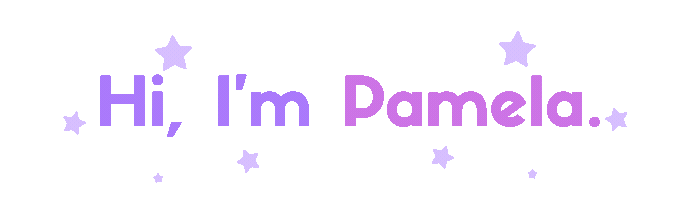

  

  

Hi! I'm Pamela, a student of Analysis and Systems Development (ADS) with a strong passion for both design and development.
  Today, I'm focused on becoming a fullstack developer, combining my love for logic and problem-solving with my eye for user experience and clean interfaces.  
  I truly believe that great code and great design go hand in hand, and I'm always seeking to improve on both fronts.

###

### 🌱 I'm currently learning...
- 💻 JavaScript  
- ⚛️ Planning to dive into React and Node.js soon  
- 🎨 UX/UI fundamentals to craft better user experiences  

###

<h2 align="left">My skills include</h2>
<h4 align="left">Languages</h4>

  
  
  
  
  
  
  
  
  
  
  

###

<h4 align="left">Other tools and technologies</h4>

  
  
  
  
  

###

<h2 align="left">My Streak</h2>

  

<h2 align="left">Check out my Social Media</h2>

###

  
  

